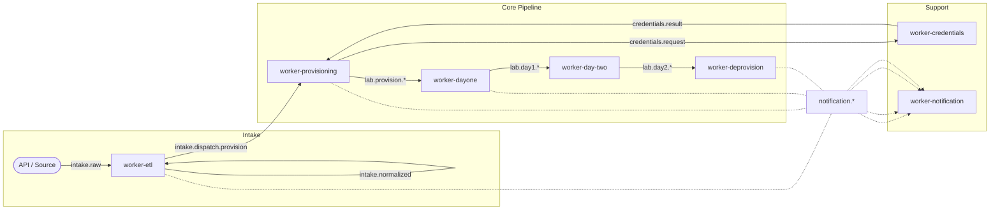
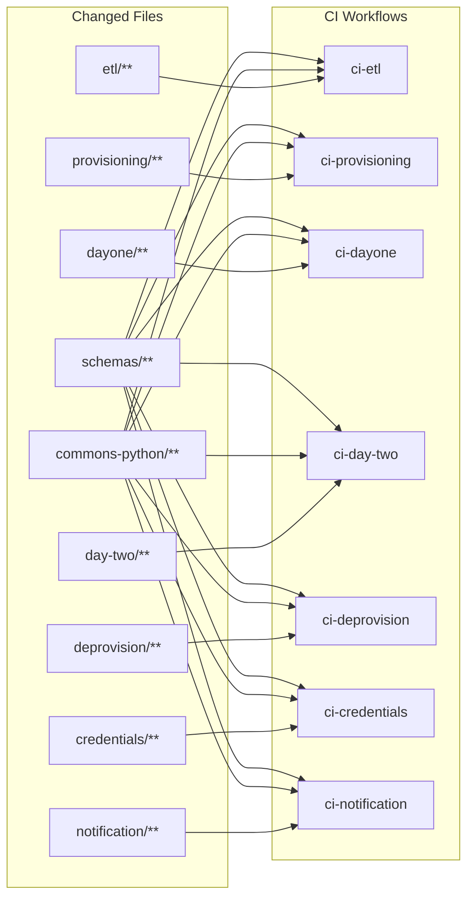
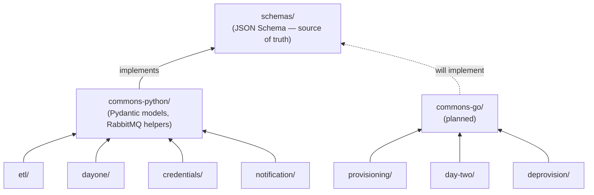

# Workers Monorepo — Structure & Workflow

---

## Repo Structure

```
workers/
├── schemas/                        # AUTHORITY — language-neutral source of truth
│   ├── envelope.schema.json        # MessageEnvelope JSON Schema
│   ├── README.md                   # How to add/modify schemas, contract tests
│   └── payloads/                   # Per-event-type payload schemas
│       ├── intake.raw.schema.json
│       ├── intake.normalized.schema.json
│       └── ...
│
├── commons-python/                 # Python implementation of schemas/
│   ├── envelope.py                 # MessageEnvelope builder/parser
│   ├── rabbitmq.py                 # RabbitMQ connection/consume/publish helpers
│   ├── config_base.py              # Base Settings class (shared env patterns)
│   ├── README.md                   # API surface & usage examples
│   └── pyproject.toml              # Package name: commons
│
├── commons-go/                     # Go implementation of schemas/ (planned)
│   ├── envelope.go
│   ├── rabbitmq.go
│   ├── envelope_test.go
│   └── go.mod
│
├── etl/                            # worker-etl
│   ├── src/
│   │   ├── __init__.py
│   │   ├── __main__.py
│   │   ├── config.py
│   │   ├── schema.py
│   │   ├── transform.py
│   │   └── worker.py
│   ├── tests/
│   ├── k8s/                        # Kustomize base manifests for this worker
│   │   └── configmap-etl-schema.yaml
│   ├── Containerfile
│   └── pyproject.toml              # deps: includes commons as local path dep
│
├── provisioning/                   # worker-provisioning
│   ├── src/ tests/ k8s/
│   ├── Containerfile
│   └── pyproject.toml
│
├── dayone/                         # worker-dayone
│   ├── src/ tests/ k8s/
│   ├── Containerfile
│   └── pyproject.toml
│
├── deprovision/                    # worker-deprovision
│   ├── src/ tests/ k8s/
│   ├── Containerfile
│   └── pyproject.toml
│
├── credentials/                    # worker-credentials
│   ├── src/ tests/
│   ├── Containerfile
│   └── pyproject.toml
│
├── notification/                   # worker-notification
│   ├── src/ tests/
│   ├── Containerfile
│   └── pyproject.toml
│
├── day-two/                        # worker-day-two
│   ├── src/ tests/
│   ├── Containerfile
│   └── pyproject.toml
│
├── .github/
│   └── workflows/
│       ├── ci-etl.yaml
│       ├── ci-provisioning.yaml
│       ├── ci-dayone.yaml
│       ├── ci-deprovision.yaml
│       ├── ci-credentials.yaml
│       ├── ci-notification.yaml
│       └── ci-day-two.yaml
│
├── podman-compose.yaml             # Local dev: RabbitMQ, workers
├── Makefile                        # Convenience targets (see CONTRIBUTING.md)
├── CONTRIBUTING.md                 # Local dev setup, PR conventions, adding workers
└── README.md
```

### Message Flow

How workers connect through RabbitMQ queues:



> **Solid arrows** = primary pipeline. **Dashed** = async side-channels.
> Queue names are illustrative — see `schemas/payloads/` for the full list.

---

## Sparse Checkout — Work on One Worker

Git sparse checkout lets you clone the repo but only materialize the folders you need on disk. Root-level files (`Makefile`, `README.md`, `podman-compose.yaml`) are always included automatically in cone mode.

### First time setup

```bash
git clone --no-checkout git@github.com:org/workers.git
cd workers

git sparse-checkout init --cone

# Pull only etl worker + shared libs + schemas
git sparse-checkout set etl commons-python schemas

git checkout main
```

Your working directory now contains:

```
workers/
├── schemas/
├── commons-python/
├── etl/
├── .github/              # always included (cone mode)
├── podman-compose.yaml   # always included (root-level)
├── Makefile              # always included (root-level)
├── CONTRIBUTING.md
└── README.md
```

### Add another worker later

```bash
git sparse-checkout add dayone
```

### Work on everything

```bash
git sparse-checkout disable
```

### Shortcut: Makefile targets

```makefile
sparse-etl:
	git sparse-checkout set etl commons-python schemas

sparse-dayone:
	git sparse-checkout set dayone commons-python schemas

sparse-all:
	git sparse-checkout disable
```

> **Note:** Cone mode always includes root-level files, so there is no need to
> list `Makefile`, `README.md`, or `.github` in the `set` command.

---

## CI — Path-Filtered Triggers

Each worker gets its own GitHub Actions workflow. It only runs when files in that worker's directory **or** the shared `commons-python/` / `schemas/` directories change.

### Example: `.github/workflows/ci-etl.yaml`

```yaml
name: CI — worker-etl

on:
  push:
    branches: [main, develop]
    paths:
      - 'etl/**'
      - 'commons-python/**'
      - 'schemas/**'
  pull_request:
    paths:
      - 'etl/**'
      - 'commons-python/**'
      - 'schemas/**'

jobs:
  test:
    runs-on: ubuntu-latest
    steps:
      - uses: actions/checkout@v4

      - uses: actions/setup-python@v5
        with:
          python-version: '3.12'

      - name: Install deps
        working-directory: etl
        run: pip install -e '.[dev]' -e '../commons-python'

      - name: Run tests
        working-directory: etl
        run: pytest tests/ -v

  build:
    needs: test
    runs-on: ubuntu-latest
    if: github.ref == 'refs/heads/main'
    steps:
      - uses: actions/checkout@v4

      - name: Build and push image
        run: |
          podman build -f etl/Containerfile -t ghcr.io/org/worker-etl:${{ github.sha }} .
          podman push ghcr.io/org/worker-etl:${{ github.sha }}
```

### Key behaviors

| What changes | What runs |
|---|---|
| `etl/src/transform.py` | Only `ci-etl.yaml` |
| `commons-python/envelope.py` | All Python worker CIs (every workflow lists `commons-python/**`) |
| `schemas/envelope.schema.json` | All worker CIs across languages (every workflow lists `schemas/**`) |
| `dayone/src/worker.py` | Only `ci-dayone.yaml` |
| `etl/` + `provisioning/` in same PR | `ci-etl.yaml` + `ci-provisioning.yaml` |
| `README.md` only | Nothing (no workflow matches) |



> A change to `schemas/` or `commons-python/` fans out to every workflow.
> A worker-only change triggers only that worker's CI.

---

## Schemas — Language-Neutral Source of Truth

**Convention: `schemas/` is always the authority.** The `commons-{language}` packages are implementations of those schemas, not the other way around. If there's a conflict, `schemas/` wins and the language package gets a fix.

The `schemas/` directory contains JSON Schema definitions for the `MessageEnvelope` and every payload type. These are the same schemas documented in `queue-schemas-v3.md`, extracted into individual files for programmatic consumption.

```
schemas/
├── envelope.schema.json
└── payloads/
    ├── intake.raw.schema.json
    ├── intake.normalized.schema.json
    ├── intake.dispatch.provision.schema.json
    ├── lab.provision.generate-manifests.schema.json
    ├── lab.day1.oauth-hub.create.schema.json
    ├── ...
    └── generic-task.schema.json
```

**Polyglot validation:** When a Go worker is added, `commons-go/` will implement the same envelope from `schemas/envelope.schema.json`. CI validates that all language implementations serialize and deserialize identically via cross-language contract tests. See [`schemas/README.md`](schemas/README.md) for details.

> **`commons-go/` status:** Currently planned — the directory structure is reserved but no Go workers are in production yet. When the first Go worker is added, `commons-go/` will be wired into CI with contract tests.

For schema versioning and evolution policy, see [`docs/schema-evolution.md`](docs/schema-evolution.md).

---

## Commons — Shared Libraries

Each language gets its own `commons-{language}` package implementing the contracts defined in `schemas/`. The Python package name is **`commons`**.



> Workers never import from `schemas/` directly — they go through their language's commons package.

### `commons-python/pyproject.toml`

```toml
[project]
name = "commons"
version = "0.1.0"
dependencies = [
    "pika>=1.3.2",
    "pydantic>=2.7.0",
    "pyyaml>=6.0",
]
```

### Worker `pyproject.toml` (e.g., `etl/pyproject.toml`)

```toml
[project]
name = "worker-etl"
version = "0.1.0"
dependencies = [
    "commons",                  # resolved via: pip install -e ../commons-python
    "pydantic-settings>=2.3.0",
]

[project.optional-dependencies]
dev = ["pytest>=8.0"]
```

> **Package name vs directory name:** `commons` is the Python package name
> (what appears in `pyproject.toml` and `pip list`). `commons-python/` is the
> directory. The `pip install -e ../commons-python` command installs the package
> whose metadata says `name = "commons"`. The import path is also `commons`.

### In Podman builds

The Containerfile needs access to `commons-python/` during build. **Always build from the repo root** so `COPY` can reach shared directories:

```dockerfile
# etl/Containerfile
FROM python:3.12-slim
WORKDIR /app

# Copy and install commons first (shared lib)
COPY commons-python/ /app/commons-python/
RUN pip install --no-cache-dir /app/commons-python/

# Copy and install this worker
COPY etl/ /app/etl/
RUN pip install --no-cache-dir /app/etl/

RUN useradd -r -s /bin/false etl
USER etl
ENTRYPOINT ["python", "-m", "etl.src"]
```

```bash
# Build context = repo root
podman build -f etl/Containerfile -t worker-etl .
```

> **ENTRYPOINT convention:** Each worker's `src/__main__.py` is the entry
> point. The module path is `{worker}.src` (e.g., `python -m etl.src`), which
> invokes `etl/src/__main__.py`. Ensure `etl/src/__init__.py` exists.

---

## Branching Strategy

Single branching model for the whole repo:

```
feature/*  →  PR  →  develop  →  main
```

- **`feature/etl-add-gpu-field`** — prefixed by worker name for clarity.
- **`feature/commons-add-retry-helper`** — commons changes get their own branches.
- PRs require passing CI for all affected workers (path filters handle this automatically).
- `main` is always deployable.
- Tags per worker for releases: `etl/v1.0.0`, `dayone/v1.0.0`.
- See [`CONTRIBUTING.md`](CONTRIBUTING.md) for PR review rules, hotfix process, and develop → main promotion.

---

## Why NOT Branches Per Worker

| Approach | Problem |
|---|---|
| Branch per worker | Can't see full system state. Cross-worker changes (commons update) require N merges. Version skew between workers. |
| Git submodules | Operational nightmare. Detached HEAD confusion. CI complexity. |
| Separate repos | Lose atomicity. Shared code becomes a versioning/publishing problem. Can't do atomic cross-worker PRs. |
| One language forced | Wrong tool for the job. Go is better for long-running K8s watchers; Python is better for validation/ETL. |
| **Monorepo + sparse checkout** | **Full system visible on `main`. Atomic cross-worker changes. Polyglot via `commons-{language}` packages. `schemas/` is the language-neutral authority. Developers only see what they need. CI only builds what changed.** |

---

## Further Reading

| Document | What it covers |
|---|---|
| [`CONTRIBUTING.md`](CONTRIBUTING.md) | Local dev setup, running workers, PR conventions, adding a new worker |
| [`docs/deployment.md`](docs/deployment.md) | CD pipeline, k8s manifests, image tagging, environment promotion |
| [`docs/schema-evolution.md`](docs/schema-evolution.md) | Schema versioning policy, breaking changes, migration playbook |
| [`schemas/README.md`](schemas/README.md) | Adding payload schemas, validation tooling, contract tests |
| [`commons-python/README.md`](commons-python/README.md) | Commons API, envelope usage, RabbitMQ helpers |
| [`docs/diagrams.md`](docs/diagrams.md) | All architecture diagrams in one page (message flow, dependencies, CI triggers, deploy pipeline) |
