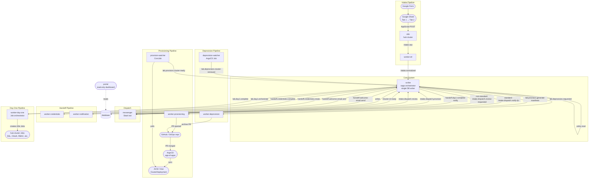
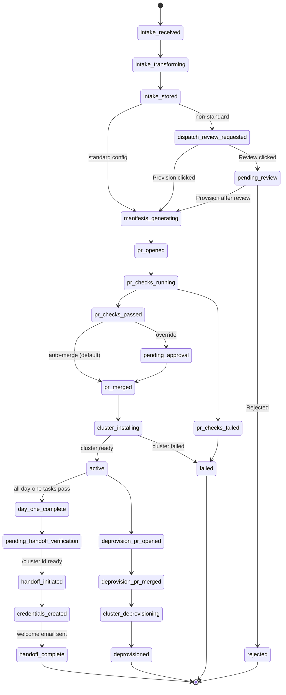
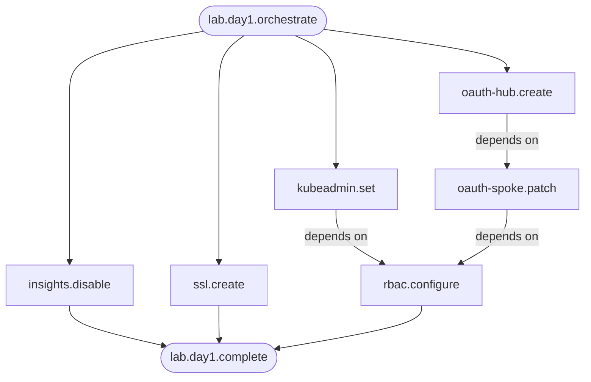

# System Architecture

> Distilled from the full technical reference (`queue-schemas-v3.md`).
> For complete queue names, payload schemas, and saga definitions, see that document.

---

## Component Map

The workers monorepo contains a subset of the full system. This page covers all components — both in-repo and external — so developers understand where their worker fits.



---

## Component Inventory

| Component | Type | In this repo? | Runs on | What it does |
|---|---|---|---|---|
| **n8n** | Workflow engine | No (self-hosted) | Hub cluster | Receives AppScript POST, validates source, publishes `intake.raw` to RabbitMQ |
| **worker-etl** | RabbitMQ consumer | Yes (`etl/`) | Hub cluster | Transforms raw Tab 2 JSON into canonical schema |
| **scribe** | Saga orchestrator | No (separate repo) | Hub cluster | Persists to DB, evaluates policy, orchestrates all sagas. Single writer. |
| **messenger** | Slack bot | No (separate repo) | Hub cluster | Posts Slack messages (FYI or interactive), handles `/cluster {id} ready`, publishes dispatch decisions |
| **worker-provisioning** | RabbitMQ consumer | Yes (`provisioning/`) | Hub cluster | Builds ACM/ArgoCD manifests, opens PR in gitops repo |
| **provision-watcher** | Standalone CronJob | No (separate) | Hub cluster | Polls for ClusterProvision ready state, publishes `cluster-ready` or `cluster-failed` |
| **worker-day-one** | Job orchestrator | Yes (`day-one/`) | Hub cluster | Reads sub-task messages, creates/triggers K8s Jobs on hub for each task |
| **worker-day-two** | Job orchestrator | Yes (`day-two/`) | Hub cluster | Day-two operations, same pattern as day-one |
| **worker-credentials** | RabbitMQ consumer | Yes (`credentials/`) | Hub cluster | Creates PrivateBin pastes with cluster credentials, publishes paste URL |
| **worker-notification** | RabbitMQ consumer | Yes (`notification/`) | Hub cluster | Sends welcome emails (with PrivateBin link) and lifecycle notifications |
| **worker-deprovision** | RabbitMQ consumer | Yes (`deprovision/`) | Hub cluster | Moves cluster manifests to archive directory, opens PR |
| **deprovision-watcher** | ArgoCD-managed Job | No (app-of-apps) | Hub cluster | Watches ClusterDeprovision completion, publishes `cluster-removed` |
| **portal** | Web app (read-only) | No (separate repo) | Hub cluster | Status dashboard, lab management UI. Does NOT handle intake. |

---

## Hub-Native Execution Model

A core architectural principle: **all components run on the hub cluster with service account permissions.** This eliminates external credential management entirely.

The provision-watcher, deprovision-watcher, and day-one Jobs all run hub-native. The hub SA already has access to ACM/Hive CRs, spoke cluster secrets, and cert-manager resources. No kubeconfigs are gathered, stored, or transmitted — spoke clusters are managed through ACM's hub-side APIs.

This means:
- Workers never need external credentials to reach spoke clusters.
- Secrets (kubeadmin passwords, kubeconfigs) are read from hub-side K8s secrets at execution time, never passed through message payloads.
- The `handoff.credentials.create` message carries secret *references* (K8s secret names), not values. worker-credentials reads the actual secrets using its SA.

---

## Intake Pipeline — Where Messages Come From

```
Google Form
  → Google Sheet Tab 1 (raw form responses)
    → Formula mirrors to Tab 2 (custom headers)
      → When "approved" column set: AppScript sends Tab 2 row as JSON
        → n8n (hub cluster) validates source, publishes to intake.raw
          → worker-etl transforms to canonical schema
            → intake.normalized → scribe
```

n8n acts as a trust boundary between AppScript and RabbitMQ. It does zero transformation — just source validation. worker-etl handles all field mapping and normalization.

---

## Lab State Machine

Every lab progresses through these states. Scribe is the single writer — only scribe transitions state.



---

## Day-One Task Dependency Graph

Day-one tasks run as K8s Jobs on the hub, orchestrated by worker-day-one. Four tasks start in parallel; the rest have dependencies.



> All four initial tasks fire simultaneously. `oauth-spoke.patch` waits for `oauth-hub.complete`.
> `rbac.configure` waits for both `kubeadmin.complete` AND `oauth-spoke.complete`.
> `lab.day1.complete` fires only when all tasks succeed.

---

## Scribe — Saga Orchestrator

Scribe is the central nervous system. It:
- Persists every state transition to the database (single writer).
- Evaluates auto-provision policy (standard vs non-standard config).
- Orchestrates all downstream sagas by publishing to the appropriate queues.
- Never performs domain work itself — it delegates to workers.

Every message flows through scribe. Workers publish results back to scribe, which decides the next step. This keeps routing logic centralized and workers stateless.

---

## Naming Conventions

| Element | Convention | Example |
|---|---|---|
| Queue names | `{domain}.{entity}.{action}` | `lab.day1.insights.disable` |
| Event types | Same as queue name | `intake.dispatch.notify-fyi` |
| Schema `$id` | URL-style, versioned | `.../payloads/lab.day1.insights.disable/v1` |
| Error codes | `SCREAMING_SNAKE_CASE` | `MISSING_REQUIRED_FIELD` |
| Source identifiers | Lowercase hyphenated component name | `provision-watcher` |
| Dead-letter queues | `dlq.{domain}` | `dlq.intake`, `dlq.provision`, `dlq.day1` |

There is also a `dlq.generic` catch-all for unroutable or malformed messages.

---

## Further Reading

- [`queue-schemas-v3.md`](../queue-schemas-v3.md) — Full queue name tables, all payload schemas, complete saga definitions
- [`docs/schema-evolution.md`](schema-evolution.md) — Versioning policy and breaking change playbook
- [`schemas/README.md`](../schemas/README.md) — Adding new payload schemas and running contract tests
