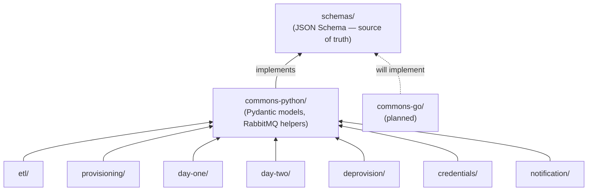
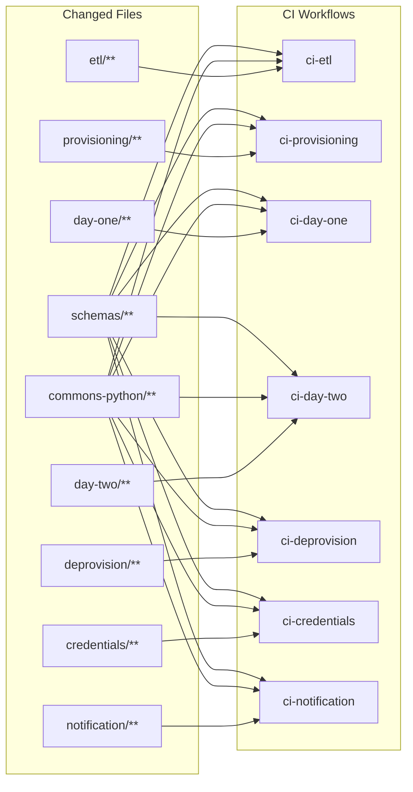

# Architecture Diagrams

All diagrams use [Mermaid](https://mermaid.js.org/) syntax and render natively in GitHub, VS Code, and most markdown viewers.

Key diagrams are also embedded inline in the relevant docs. This page collects them in one place.

---

## Message Flow

Which worker publishes to and consumes from which RabbitMQ queue.

```mermaid
flowchart LR
    subgraph Intake
        API([API / Source])
        ETL[worker-etl]
    end

    subgraph Core Pipeline
        PROV[worker-provisioning]
        D1[worker-day-one]
        D2[worker-day-two]
        DEPROV[worker-deprovision]
    end

    subgraph Support
        CRED[worker-credentials]
        NOTIF[worker-notification]
    end

    API -- intake.raw --> ETL
    ETL -- intake.normalized --> ETL
    ETL -- intake.dispatch.provision --> PROV
    PROV -- lab.provision.* --> D1
    D1 -- lab.day1.* --> D2
    D2 -- lab.day2.* --> DEPROV

    PROV -. credentials.request .-> CRED
    CRED -. credentials.result .-> PROV

    ETL -. notification.* .-> NOTIF
    PROV -. notification.* .-> NOTIF
    D1 -. notification.* .-> NOTIF
    DEPROV -. notification.* .-> NOTIF
```

> **Solid arrows** = primary pipeline flow. **Dashed arrows** = async side-channels.
> Queue names are illustrative — see `schemas/payloads/` for the full event type list.

---

## Dependency Graph

How workers, commons libraries, and schemas relate.



> Arrows point toward dependencies. Workers never import from `schemas/` directly —
> they go through their language's commons package.

---

## CI Trigger Map

What file changes trigger which CI workflows.



> **Key insight:** A change to `schemas/` or `commons-python/` fans out to every workflow.
> A change to a single worker directory triggers only that worker's CI.

---

## Branching & Deploy Pipeline

From feature branch to production cluster.

```mermaid
flowchart LR
    subgraph Git
        F["feature/*\nhotfix/*"] -->|PR + CI| DEV[develop]
        DEV -->|merge commit PR| MAIN[main]
        MAIN -->|git tag\netl/v1.0.0| TAG([release tag])
    end

    subgraph CI / Build
        MAIN -->|push triggers CI| BUILD[Build image\nghcr.io/org/worker:sha]
    end

    subgraph CD — Deployment Repo
        BUILD -->|bot updates image tag| DR_DEV[dev overlay]
        DR_DEV -->|manual promote| DR_STG[staging overlay]
        DR_STG -->|manual promote\n+ approval| DR_PROD[prod overlay]
    end

    subgraph Kubernetes
        DR_DEV -->|ArgoCD sync| K_DEV[dev cluster]
        DR_STG -->|ArgoCD sync| K_STG[staging cluster]
        DR_PROD -->|ArgoCD sync| K_PROD[prod cluster]
    end
```

> **Hotfix shortcut:** `hotfix/*` branches PR directly into `main`, then cherry-pick back to `develop`.
> See [CONTRIBUTING.md](../CONTRIBUTING.md) for the full PR workflow and [docs/deployment.md](deployment.md) for CD details.
