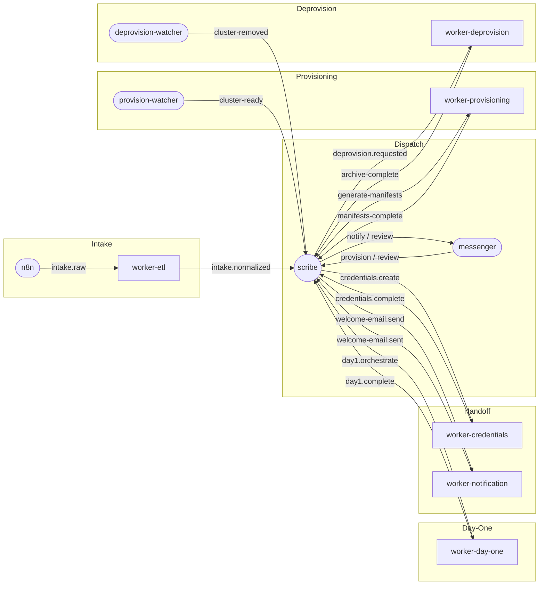
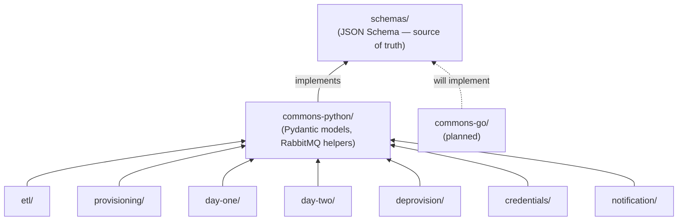
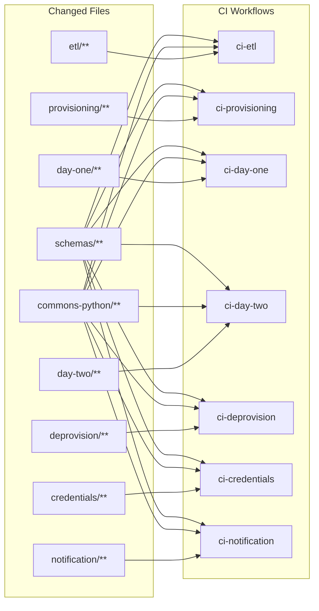
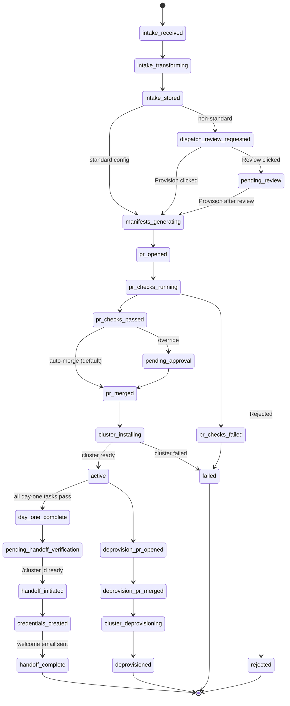
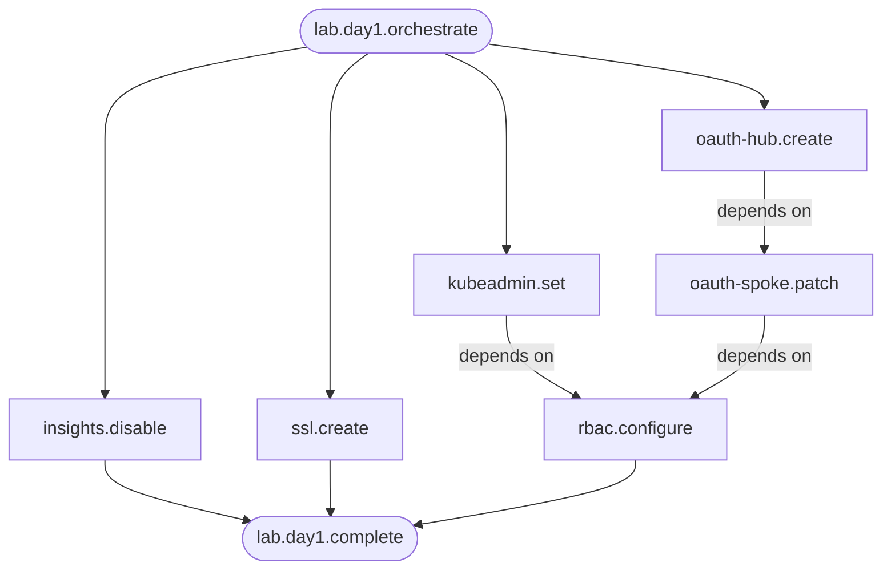

# Architecture Diagrams

All diagrams use [Mermaid](https://mermaid.js.org/) syntax and render natively in GitHub, VS Code, and most markdown viewers.

Key diagrams are also embedded inline in the relevant docs. This page collects them in one place.

---

## Message Flow

Scribe (saga orchestrator, separate repo) is the central routing hub. All workers publish results back to scribe, which decides the next step.



> Workers in **rectangles** live in the workers monorepo. **Rounded boxes** are external components.
> Queue names are abbreviated — see [docs/architecture.md](architecture.md) for the full map.

---

## Dependency Graph

How workers, commons libraries, and schemas relate.



> Arrows point toward dependencies. Workers never import from `schemas/` directly —
> they go through their language's commons package.

---

## CI Trigger Map

What file changes trigger which CI workflows.



> **Key insight:** A change to `schemas/` or `commons-python/` fans out to every workflow.
> A change to a single worker directory triggers only that worker's CI.

---

## Branching & Deploy Pipeline

From feature branch to production cluster.

```mermaid
flowchart LR
    subgraph Git
        F["feature/*\nhotfix/*"] -->|PR + CI| DEV[develop]
        DEV -->|merge commit PR| MAIN[main]
        MAIN -->|git tag\netl/v1.0.0| TAG([release tag])
    end

    subgraph CI / Build
        MAIN -->|push triggers CI| BUILD[Build image\nghcr.io/org/worker:sha]
    end

    subgraph CD — Deployment Repo
        BUILD -->|bot updates image tag| DR_DEV[dev overlay]
        DR_DEV -->|manual promote| DR_STG[staging overlay]
        DR_STG -->|manual promote\n+ approval| DR_PROD[prod overlay]
    end

    subgraph Kubernetes
        DR_DEV -->|ArgoCD sync| K_DEV[dev cluster]
        DR_STG -->|ArgoCD sync| K_STG[staging cluster]
        DR_PROD -->|ArgoCD sync| K_PROD[prod cluster]
    end
```

> **Hotfix shortcut:** `hotfix/*` branches PR directly into `main`, then cherry-pick back to `develop`.
> See [CONTRIBUTING.md](../CONTRIBUTING.md) for the full PR workflow and [docs/deployment.md](deployment.md) for CD details.

---

## Lab State Machine

Every lab progresses through these states. Scribe is the single writer — only scribe transitions state.



> See [docs/architecture.md](architecture.md) for the full state machine context and saga definitions.

---

## Day-One Task Dependencies

Four tasks start in parallel; downstream tasks wait for their dependencies.



> All tasks execute as K8s Jobs on the hub cluster, orchestrated by worker-day-one.
> `lab.day1.complete` fires only when every task succeeds.
