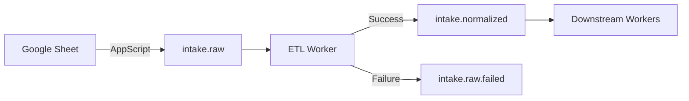
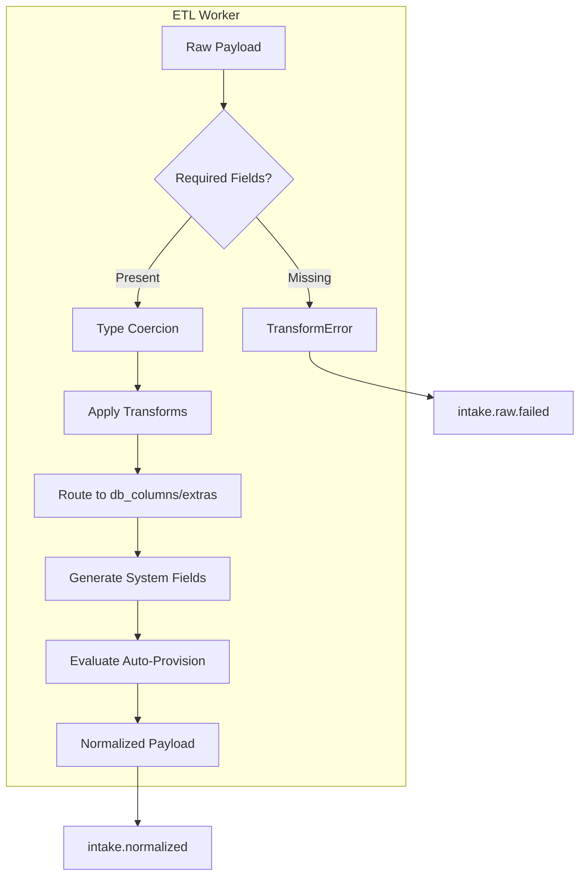

# ETL Worker

The ETL worker validates and transforms raw Google Sheet payloads (from AppScript) into a canonical `intake.normalized` schema for downstream workers in the OpenShift Partner Labs pipeline.

## Overview



**Key Features**:
- Schema-driven field mapping (YAML configuration, no code changes needed)
- Type coercion and validation (email, datetime, required fields)
- Name splitting transforms (full name → first/last)
- Auto-provision policy evaluation
- Structured error handling with machine-readable codes
- Stateless, idempotent, horizontally scalable

## Quick Start

### Prerequisites

- Python 3.12+
- RabbitMQ (for running the worker)
- uv or pip

### Install

```bash
cd workers/etl

# Using uv (recommended)
uv sync

# Or using pip
pip install -e '.[dev]'
```

### Run Tests

```bash
uv run pytest test_transform.py -v

# With coverage
uv run pytest test_transform.py -v --cov=. --cov-report=term-missing
```

### Run the Worker

```bash
# Start RabbitMQ first
podman run -d --name rabbitmq -p 5672:5672 -p 15672:15672 rabbitmq:3-management

# Run the worker
uv run python -m worker
```

## Architecture



### Transform Pipeline

1. **Validate required fields** - Check all required source keys are present and non-empty
2. **Type coercion** - Convert values to expected types (string, int, email, datetime, etc.)
3. **Apply transforms** - Run transforms like `split_name_first`, `split_name_last`
4. **Route fields** - Map to `db_columns` or `extras` JSONB based on schema
5. **Generate system fields** - Create `cluster_id`, `cluster_name`, `generated_name`
6. **Evaluate auto-provision** - Determine if request qualifies for automatic provisioning
7. **Compute derived values** - Calculate `end_date` from `start_date` + `lease`

### Schema-Driven Design

Field mappings, types, and transforms are defined in YAML (`configmap-etl-schema.yaml`), not hardcoded. Update the ConfigMap and restart to change behavior—no code changes required.

```yaml
fields:
  - source_key: company_name
    db_column: company_name
    type: string
    required: true

  - source_key: primary_contact_name
    db_column: primary_first
    type: string
    required: true
    transform: split_name_first
```

See [Schema Reference](./docs/schema-reference.md) for full documentation.

## Configuration

All configuration via environment variables (12-factor). Variables use the `ETL_` prefix.

| Variable | Default | Description |
|----------|---------|-------------|
| `ETL_RABBITMQ_HOST` | `localhost` | RabbitMQ hostname |
| `ETL_RABBITMQ_PORT` | `5672` | RabbitMQ port |
| `ETL_RABBITMQ_USER` | `guest` | RabbitMQ username |
| `ETL_RABBITMQ_PASS` | `guest` | RabbitMQ password |
| `ETL_RABBITMQ_VHOST` | `/` | RabbitMQ virtual host |
| `ETL_CONSUME_QUEUE` | `intake.raw` | Queue to consume from |
| `ETL_PUBLISH_QUEUE` | `intake.normalized` | Queue for successful transforms |
| `ETL_FAILED_QUEUE` | `intake.raw.failed` | Queue for failed messages |
| `ETL_SCHEMA_PATH` | `/etc/etl-schema/schema.yaml` | Path to schema YAML |
| `ETL_SOURCE_ID` | `worker-etl` | Worker identity in message envelopes |
| `ETL_PREFETCH_COUNT` | `1` | Messages to prefetch (1 = one at a time) |

### Schema ConfigMap

In Kubernetes, the schema is mounted from a ConfigMap:

```yaml
apiVersion: v1
kind: ConfigMap
metadata:
  name: etl-field-schema
data:
  schema.yaml: |
    version: "1.0.0"
    fields:
      - source_key: company_name
        db_column: company_name
        # ...
```

Mount at `/etc/etl-schema/schema.yaml` in the pod spec.

## Message Envelope

All messages use a standard envelope for distributed tracing:

```json
{
  "event_type": "intake.normalized",
  "event_id": "550e8400-e29b-41d4-a716-446655440000",
  "timestamp": "2026-03-15T10:30:00.000Z",
  "source": "worker-etl",
  "correlation_id": "a1b2c3d4-e5f6-7890-abcd-ef1234567890",
  "causation_id": "previous-event-id",
  "version": "1.0.0",
  "retry_count": 0,
  "payload": { ... }
}
```

| Field | Description |
|-------|-------------|
| `event_type` | Message type (e.g., `intake.normalized`, `intake.raw.failed`) |
| `event_id` | Unique ID for this message |
| `timestamp` | ISO 8601 timestamp when message was created |
| `source` | Worker that produced the message |
| `correlation_id` | Traces a request through the entire pipeline |
| `causation_id` | ID of the message that caused this one |
| `version` | Envelope schema version |
| `retry_count` | Number of times this message has been retried |
| `payload` | The actual message data |

### Tracing with correlation_id

The `correlation_id` is preserved across all workers in the pipeline. Use it to trace a request from intake to provisioning:

```
intake.raw (correlation_id=abc)
    → intake.normalized (correlation_id=abc, causation_id=raw-event-id)
        → lab.provision.requested (correlation_id=abc, causation_id=normalized-event-id)
```

## Deployment

### Container Build

From the `workers/` root directory:

```bash
podman build -f etl/Containerfile -t worker-etl:latest .
```

### Kubernetes

See [Deployment Guide](../docs/deployment.md) for:
- Kubernetes manifests
- ArgoCD configuration
- CI/CD pipeline

### Health Checks

The worker uses RabbitMQ heartbeats (60s interval) to maintain connection health. For Kubernetes liveness/readiness, check the RabbitMQ connection status.

## Error Handling

Failed messages are routed to `intake.raw.failed` with structured error details:

```json
{
  "event_type": "intake.raw.failed",
  "payload": {
    "form_response_id": "abc123",
    "sheet_row_number": 42,
    "error": {
      "code": "MISSING_REQUIRED_FIELD",
      "message": "Required fields missing or empty: sponsor",
      "missing_fields": ["sponsor"],
      "raw_row": { ... }
    }
  }
}
```

### Error Codes

| Code | Description |
|------|-------------|
| `MISSING_REQUIRED_FIELD` | Required field is missing or empty |
| `MALFORMED_EMAIL` | Email field failed format validation |
| `TYPE_COERCION_FAILED` | Value could not be converted to expected type |
| `INVALID_DATETIME` | Datetime field could not be parsed |
| `UNEXPECTED_ERROR` | Unhandled exception (bug or unexpected input) |

See [Troubleshooting Guide](./docs/troubleshooting.md) for solutions.

## Development

### Code Structure

```
etl/
├── config.py          # Environment configuration
├── worker.py          # RabbitMQ consumer/producer
├── transform.py       # Core ETL logic
├── schema.py          # Schema loading
├── envelope.py        # Message envelope helpers
├── test_transform.py  # Unit tests
└── docs/              # Documentation
```

### Key Modules

| Module | Responsibility |
|--------|----------------|
| `config.py` | pydantic-settings based config from `ETL_*` env vars |
| `transform.py` | Validation, coercion, transforms, auto-provision policy |
| `schema.py` | YAML schema loading with lookup structures |
| `worker.py` | RabbitMQ connection, message routing, error handling |

See [Developer Guide](./docs/developer-guide.md) for:
- Adding new field mappings
- Adding new transforms
- Adding new generators
- Testing patterns

## Related Documentation

### ETL Worker Docs
- [Schema Reference](./docs/schema-reference.md) - Schema format specification
- [Developer Guide](./docs/developer-guide.md) - Local development and extending
- [Troubleshooting](./docs/troubleshooting.md) - Common errors and solutions

### Parent Repository
- [Architecture](../docs/architecture.md) - System overview and worker interactions
- [Message Patterns](../docs/diagrams.md) - Message flow diagrams
- [Deployment](../docs/deployment.md) - CI/CD and Kubernetes deployment
- [Schema Evolution](../docs/schema-evolution.md) - Breaking change policy
- [Contributing](../CONTRIBUTING.md) - Development setup and PR process

## License

See repository root for license information.
